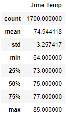
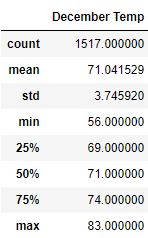

# Surfs Up!

## Purpose
The purpose of this data analysis was to gain insight on temperature data in the months of June and December in Oahu, to determine if the surf and ice cream shop business is sustainable year round.

The purpose of the assignment was to write queries using python, sqlalchemy, and sqlite, create dataframes, and calculate and print summary statistics.

## Results

- The mean temperature in June is 74.94°F, while the mean temperature in December is 71.04°F.
- The minimum temperature in June is 64.00°F, while the minimum temperature in December is 56.00°F.
- The maximum temperature in June is 85.00°F, while the maximum temperature in December is 83.00°F.

## Summary
In regards to temperature, both months provide reasonable weather for surfing conditions and ice cream consumption.
The maximum temperatures only differ by 2 degrees. 
The minimum temperature differs by 8 degrees, this is significant and may suggest that June is the better month.
The mean temperature only differs by about 4 degrees.

### Additional queries
When it comes to surfing, there are several variables that come into play. Having temperature as the defining variable is unrealistic. 
Precipitation, and wind conditions(speed and duration) will have a major impact.

I would perform queries to find the summary statistics of precipitation and wind conditions for both months.
In addition, I would perform more specific queries to the temperature to find the instances of maximum. and minimum temperatures while comparing months. I would also perform queries to determine the duration of optimal temperatures throughout the day. Hourly temperature data.
